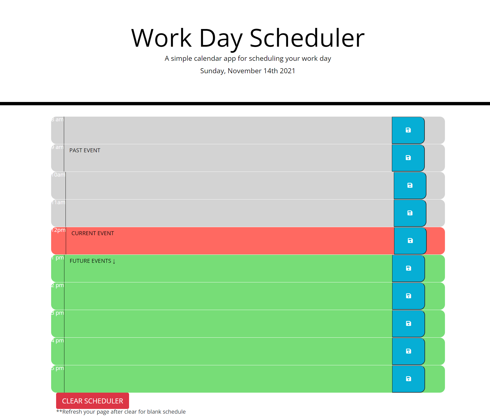

# Workday Scheduler

This calendar application allows a user to plan and save events for each hour of the current day (8am-5pm). The application uses JQuery, Bootstrap, and Moment.js APIs for its interface and functionality. Application will allow users to save their tasks/input into their local storage and retrieve at a later time. Application will display gray timeblocks for past events/times, red for current event/times, and green for future events/times. I also added a button to clear local storage at the user's discretion.

Acceptance Criteria is below.

---
### Acceptance Criteria

```
GIVEN I am using a daily planner to create a schedule
WHEN I open the planner
THEN the current day is displayed at the top of the calendar
WHEN I scroll down
THEN I am presented with time blocks for standard business hours
WHEN I view the time blocks for that day
THEN each time block is color-coded to indicate whether it is in the past, present, or future
WHEN I click into a time block
THEN I can enter an event
WHEN I click the save button for that time block
THEN the text for that event is saved in local storage
WHEN I refresh the page
THEN the saved events persist
```
---
### Deployed Application

The following is a screenshot of the application as well as a link to the deployed application:

https://krissmith7.github.io/workday-scheduler/




